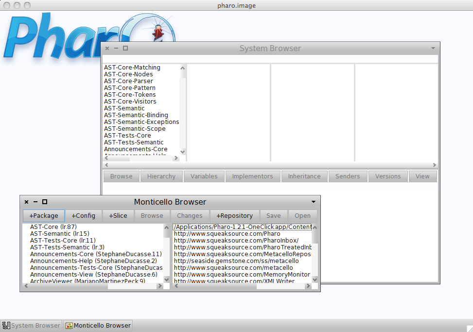
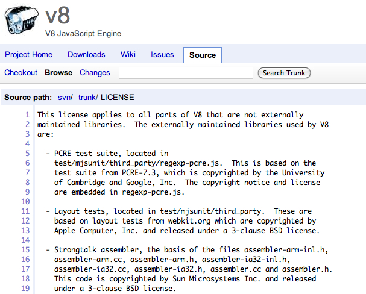

!SLIDE center transition=scrollUp

# It all started with Alan Kay

### "Most ideas come from previous ideas"

!SLIDE center

# at

!SLIDE smbullets incremental transition=fade

### Smalltalk to underpin "new world" of computing exemplified by "human–computer symbiosis"

* "Human-Computer Symbiosis" - term used in the 60's, primarily by ARPA community
* Smalltalk was part of the larger pursuit called personal computing

!SLIDE smbullets incremental transition=fade

## Smalltalk development began as early as 1969

* Smalltalk-71, 72 released internally
* Smalltalk-76 introduce the development environment (IDE)
* Smalltalk-80 introduced metaclasses
* General availability in 1983 as `Smalltalk-80 Version 2`
* Smalltalk typically refers to the programming environment

!SLIDE bullets incremental

## Alan Kay was the original designer of Smalltalk

* His emotional involvement was centered on personal computing
* Dan Ingallis was the central figure of Smalltalk development, an implementer
* Adele Goldberg and Xerox PARC team helped get Smalltalk out the door

!SLIDE center transition=fade

## Alto running Smalltalk

!SLIDE center transition=scrollUp

## Pharo Smalltalk

!SLIDE smbullets transition=fade

## Xerox PARC formed ParcPlace Systems

* a spin-off company to bring Smalltalk to the market
* Digitalk was another company bringing Smalltalk to Windows/IBM's OS/2
* ParcPlace was focused on UNIX/Sun Microsystem

!SLIDE bullets transition=fade

## In 1995, those two companies merged

* Company renamed to ParcPlace-Digitalk
* Then in 1997, rebranded as ObjectShare
* Two years later, RIP

!SLIDE 

## What Killed Smalltalk?

!SLIDE smbullets incremental transition=fade

### In no particular order

* Java was taking over the world
* VM concept too futuristic in its day and had substantial memory needs
* Fragmentation in the Smalltalk implementations (like Lisp)
* Source Control Repository (difficult to share code)
* "...it was just too easy to make a mess" - [Uncle Bob Martin](http://en.oreilly.com/rails2009/public/schedule/detail/8482)

!SLIDE smbullets transition=scrollUp

## Smalltalk Implementations are Dialects

* Pharo
* GNU Smalltalk
* Squeak
* [redline.st](https://github.com/jamesladd/redline-smalltalk) (Smalltalk on the JVM)
* Cincom's VisualWorks and ObjectStudio
* Gemstone (heard of MagLev?)
* Object Arts' Dolphin Smalltalk

!SLIDE center

## Other Fun Facts

### Inside your [Chrome](http://groups.google.com/group/strongtalk-general/browse_thread/thread/40eb8f405fbd3041) making your JavaScript faaast!

!SLIDE bullets incremental

### Strongtalk was an implementation of Smalltalk with optional static typing support

* Sun Microsystems swooped in and acquired Strongtalk
* Influenced the development of Java's HotSpot VM (standard VM)
* Now in your Chrome

!SLIDE

### Squeak was used to provide Etoys environment on the OLPC project
