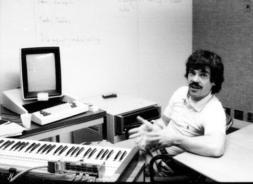

!SLIDE center transition=scrollUp

# It all started with Alan Kay

### "If you don't fail at least 90% of the time, you're not aiming high enough"

!SLIDE transition=fade

## who betted: 
## "You could define the most powerful language in the world in a page of code"

!SLIDE bullets incremental

## Dan Ingallis and Ted Kaehler replied:

* "put up or shut up"

!SLIDE bullets incremental

## Smalltalk Implementations are Dialects

!SLIDE smbullets incremental transition=fade

* Smalltalk development began in 1969
* General availability in 1983 as `Smalltalk-80 Version 2`
* Smalltalk is about the living environment

!SLIDE smbullets transition=scrollUp

# Lots of Implementations
## (these are the major ones)

* Pharo
* Squeak
* GNU Smalltalk
* VisualWorks
* Dolphin Smalltalk
* VA Smalltalk
