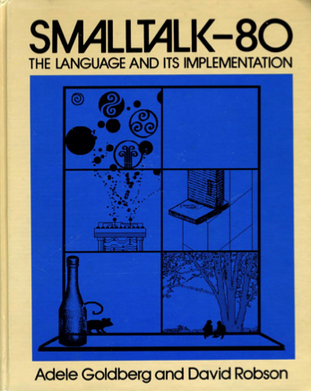

!SLIDE smbullets incremental transition=scrollUp

# Inception

* Alan Kay, Dan Ingallis, Adele Goldberg of Xerox PARC
* Development began in 1969
* General availability in 1983 as Smalltalk\-80 Version 2
* *Smalltalk* as a word by itself usually means Smalltalk\-80
* Smalltalk\-80 Version 2 is the current stable release

!SLIDE bullets incremental

# Influenced By

* Lisp
* Simula
* Sketchpad
* Logo

!SLIDE smbullets incremental

# Influenced

* Self
* Ruby
* Java
* Objective\-C
* Python
* Perl
* and more...

!SLIDE 

## Smalltalk introduced the term *object-oriented programming*

!SLIDE center

### Most implementations followed the Blue Book

!SLIDE bullets incremental

# *Not the same as ANSI Smalltalk*

* ANSI Smalltalk came after the Blue Book

!SLIDE smbullets

# Major implementations

* Pharo
* Squeak
* GNU Smalltalk
* VisualWorks
* Dolphin Smalltalk
* VA Smalltalk
