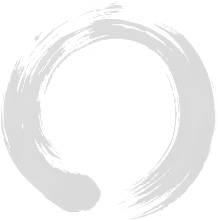

!SLIDE

# Hands-on gst

!SLIDE center

## Who has heard of Ruby Koans?

!SLIDE bullets incremental

## Created by Jim Weirich and Joe O'Brien at EdgeCase

* teaches you Ruby through a set of tests.
* there are other koans like Clojure Koans

!SLIDE bullets incremental

## Inspiration to write something for GNU Smalltalk
